<div align="center">



<br />

# 👋 Hi, I'm Viswaroop Vadlamudi

### Platform Engineering · DevSecOps · Identity Platforms · Cloud Infrastructure · AI-Native Automation

I build secure, scalable, developer-friendly platforms across cloud infrastructure, DevSecOps, and identity systems — while exploring how AI can transform the way engineering platforms are designed, automated, operated, and secured.

<br />

[](https://viswaroop.dev)
[](https://github.com/vviswaroop)
[](mailto:hello@viswaroop.dev)
[](#)

</div>

---

## 🧭 About Me

I’m a **Platform, DevOps, and DevSecOps Engineer** with hands-on experience across **AWS, Kubernetes, GitOps, CI/CD, identity platforms, security automation, and observability**.

What makes my current journey different is my focus on becoming an **AI-native infrastructure engineer** — someone who not only understands cloud platforms deeply, but also knows how to use **LLMs, automation agents, and AI-assisted workflows** to make engineering teams faster, safer, and more effective.

I’m focused on applying AI practically inside platform engineering — not as a replacement for engineering judgment, but as a force multiplier for automation, documentation, troubleshooting, security reviews, and developer experience.

---

## ⚡ My Engineering Identity

<table>
  <tr>
    <td width="50%">
      <h3>☁️ Platform Engineering</h3>
      <p>Building reusable cloud-native platforms that help product teams deploy faster with consistency, security, and reliability.</p>
    </td>
    <td width="50%">
      <h3>🔐 DevSecOps</h3>
      <p>Embedding security into cloud infrastructure, Kubernetes, CI/CD pipelines, identity, secrets, and operational workflows.</p>
    </td>
  </tr>
  <tr>
    <td width="50%">
      <h3>🔑 Identity Platforms</h3>
      <p>Architecting OAuth2-based B2B identity systems for secure API access, client onboarding, token flows, and long-term platform extensibility.</p>
    </td>
    <td width="50%">
      <h3>🤖 AI-Native Automation</h3>
      <p>Exploring practical AI workflows for infrastructure generation, documentation, troubleshooting, platform operations, and developer productivity.</p>
    </td>
  </tr>
  <tr>
    <td width="50%">
      <h3>🏗️ Software Architecture</h3>
      <p>Thinking through service boundaries, platform ownership, API design, reliability, scalability, operational models, and developer experience.</p>
    </td>
    <td width="50%">
      <h3>🚀 GitOps & Reliability</h3>
      <p>Designing declarative, automated, observable delivery systems using GitOps, Kubernetes, and modern CI/CD patterns.</p>
    </td>
  </tr>
</table>

---

## 🛠️ Tech Stack

<div align="center">

### Cloud & Infrastructure


### GitOps, Delivery & Automation


### DevSecOps, Identity & Observability


### Software Development & Architecture


</div>

---

## 🤖 AI-Native Engineering Focus

<div align="center">


</div>

**Areas I’m exploring and applying:**

- AI-assisted infrastructure design and review
- LLM-powered documentation, runbooks, and operational knowledge systems
- Agentic workflows for CI/CD, incident response, and platform operations
- AI-enhanced internal developer platforms
- Secure and governed adoption of AI in engineering workflows

---

## 🧱 Software Engineering & Identity Platform Architecture

Beyond infrastructure and DevSecOps, I’m also interested in **software development, system design, and platform architecture** — especially in the identity and access management space.

I’m currently focused on architecting and building an **enterprise B2B identity platform** that supports secure API access, OAuth2-based authentication, client onboarding, token management, and future self-service capabilities.

<table>
  <tr>
    <td width="50%">
      <h3>🔑 Identity Platform</h3>
      <p>Designing OAuth2-based systems for B2B API access, client credentials, token flows, secrets management, and secure customer onboarding.</p>
    </td>
    <td width="50%">
      <h3>🏗️ System Architecture</h3>
      <p>Thinking through platform boundaries, service ownership, API design, operational models, scalability, reliability, and long-term extensibility.</p>
    </td>
  </tr>
  <tr>
    <td width="50%">
      <h3>💻 Software Development</h3>
      <p>Building practical engineering solutions using APIs, automation, backend services, scripting, integration workflows, and developer-facing tooling.</p>
    </td>
    <td width="50%">
      <h3>👥 Technical Leadership</h3>
      <p>Leading platform initiatives from idea to implementation by connecting architecture, security, infrastructure, operations, and developer experience.</p>
    </td>
  </tr>
</table>

---

## 🔭 Current Focus Areas

```yaml
platform_engineering:
  - Kubernetes-as-a-Service patterns
  - Internal developer platforms
  - GitOps-based delivery models
  - Helm and Kustomize standardization

devsecops:
  - Secure CI/CD workflows
  - OAuth2 and identity platforms
  - Secrets management
  - Policy and governance automation

identity_platforms:
  - Enterprise B2B authentication
  - OAuth2 client credentials flow
  - Token lifecycle and platform security
  - Self-service client onboarding

software_architecture:
  - API design
  - Service boundaries
  - Platform extensibility
  - Operational ownership models

ai_native_engineering:
  - AI-assisted DevOps workflows
  - Agentic infrastructure automation
  - LLM-powered documentation and runbooks
  - AI-assisted troubleshooting and incident response

observability:
  - OpenSearch logging architecture
  - ClickHouse logging exploration
  - Metrics, dashboards, and operational insights

## 🔗 Connect & Explore

* 🌐 **Personal Website**: [viswaroop.dev](https://viswaroop.dev) &mdash; Explore my custom systems designs and architectural blueprints.
* ✍️ **Blog & Deep Dives**: [viswaroop.dev/blog](https://viswaroop.dev/blog) &mdash; Inside stories on why AI infrastructure breaks, ORY identity integrations, and Kubernetes at scale.


